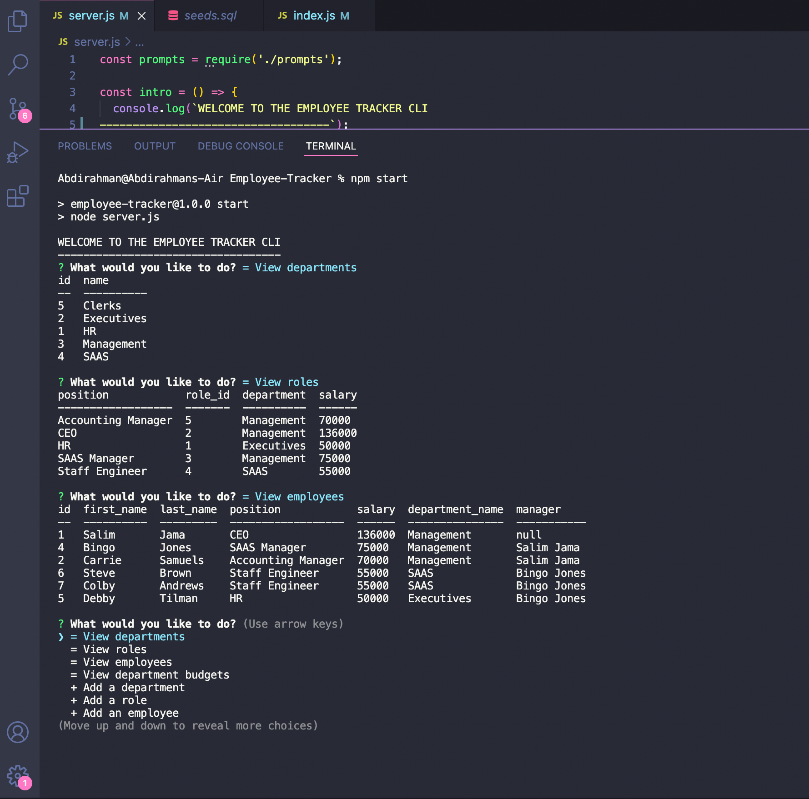

# Employee-Tracker

## Table of contents:

- [Description](#description)
- [Installation](#installation-and-Usage)
- [Contributors](#contributors)
- [Questions](#questions)

### Description:

A command-line application to manage a company's employee database, using Node.js, Inquirer, and MySQL!

screenshots of running program: 

### Installation and Usage:

The only thing you need to run this program is node package manager! Run 'npm i' in the command line to install all the necessary dependencies. Then run your mysql database with 'mysql -u root -p' and input your password. Next type 'source db/schema.sql' then 'source db/seeds.sql' and finally exit the mysql program. Lastly you want to initiate the Employee Tracker program by typing 'npm start' and you're good to go!

### License:

This project is licensed under: MIT

### Contributors:

Abdirahman

### Questions:

If you have any questions contact Abdirahman on [Github](https://github.com/aden-abdirahman)
or [Email](https://aden.abdirahman45@gmail.com)

Link to video walkthrough: [Video](https://drive.google.com/file/d/13EaVFPYs8lJNN4FlP-sFmewmhIk9XlL_/view?usp=sharing)
